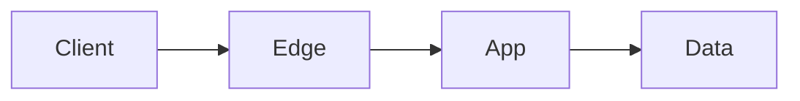

# Architecture — {Service name}

## Context

- **Users / systems:**  
- **Tier (Starter / Lean / Growth / Critical):**  
- **PRI summary:**  

## Diagram

## Components

| Layer | Choice | Notes |
|-------|--------|-------|
| Runtime | | |
| Data | | |
| Ingress | | |
| Async | | |

## Assumptions & limits

## Links

- Core tier: `stackcraft-core/tiers/...`  
- Sector: `stackcraft-sectors/sectors/...`
