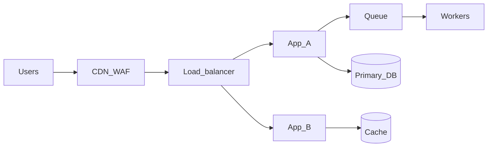

# Growth Production Architecture

## Overview

A scalable production layout for teams that need **higher availability than a single box**, **horizontal scale** for the application tier, and **operational clarity** when things break. Traffic is spread across instances; data stays on managed stores with backups (and optional read replicas or failover where justified).

This tier is where systems become **resilient under growth**, not merely functional.

## Architecture

**User → DNS / CDN (often with WAF) → Load balancer → Application cluster (multiple instances)**

**Application cluster → Managed database (+ optional cache, queues, workers)**

**CI/CD → Staging → (pre-prod if used) → Production**

**Observability → Centralized logs + metrics + (optional) distributed tracing**

**Assumptions:** staging mirrors production **topology at smaller scale**; consistency expectations for **cache vs database** are documented; async work (queues) has a defined **replay or idempotency** story.

## Components

### Application layer

- **Multiple instances** (containers on a scheduler, VM scale sets, or managed platform with replicas)
- **Horizontal scaling** (manual thresholds, scheduled scale, or autoscale policies)
- **Health checks** tied to load balancer or orchestrator so bad instances drain safely

### Load balancing

- Distributes traffic across healthy instances
- **TLS termination** at edge or load balancer (team choice; document either way)
- Optional **sticky sessions** only when required (prefer stateless app design)

### Database

- **Managed** relational store (PostgreSQL, MySQL, etc.) with automated backups
- **Optional read replicas** for read scale or reporting
- **Failover / multi-AZ** where provider and budget support it and the business requires it

### Async and offload

- **Queues** for background work, spikes, and decoupling
- **Workers** scaled independently from web tier where useful
- **Cache** (e.g. Redis) only with explicit invalidation or TTL strategy

### Observability

- **Centralized** application and platform logs
- **Metrics** for infra and app golden signals (latency, traffic, errors, saturation)
- **Alerting** on actionable thresholds
- **Distributed tracing** (sampled) optional but high leverage for multi-service debug

### Deployment

- **Rolling**, **blue/green**, or **canary** releases with health gates
- **Feature flags** for risky paths
- **Database migrations** decoupled from app deploy when migrations are risky

### Backup and recovery

- Automated, **versioned** backups for data stores
- **Retention** policy aligned to RPO expectations
- Awareness that **queues and in-flight work** are not fully captured by DB snapshots alone

## Related

- [operations.md](operations.md)
- [observability.md](observability.md)
- [backups.md](backups.md)
