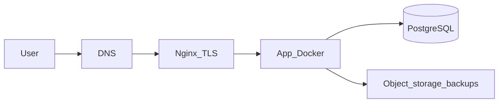

# Starter Production Architecture

## Overview

A simple, cost-effective production system designed for:

- early-stage products  
- small teams  
- limited budget (**~$75–$300/mo** — verify live pricing)  

This is **not** highly available. It **is** a pattern where you can run **real users** if you do not skip backups, logs, monitoring, and TLS.

## Architecture

**User → DNS → Nginx → Application (Docker) → Database**

## Components

### Compute

- Single VM (e.g. DigitalOcean Droplet, EC2, equivalent)

### Reverse proxy

- **Nginx** (or Caddy) — TLS termination, HTTP → app routing

### Application

- **Docker** container (or small compose stack) — predictable deploys

### Database

- **PostgreSQL** — **managed** strongly preferred; self-hosted only with the same backup discipline

### Storage

- **Object storage** for database dumps and optional artifacts (e.g. S3, Spaces)

### Monitoring

- Basic host/app metrics + **uptime checks** on a public health URL

### Alerting

- **Email / Slack** (and paging later if needed)

### Security

- Cloud/host **firewall** (SSH restricted, 80/443 public as needed)  
- **Basic hardening** — no password SSH, unattended security updates or managed patching story  

## Key principle

Keep it simple — but **do not skip production basics**: backups (tested restore), logs, monitoring, alerts, SSL, access control.

## Related

- [observability.md](observability.md) · [backups.md](backups.md) · [tradeoffs.md](tradeoffs.md)  
- Industry fit: [stackcraft-sectors](../../../stackcraft-sectors/sectors/)  
- Implementation: [stackcraft-setups](../../../stackcraft-setups/recipes/starter-saas-on-digitalocean.md)
